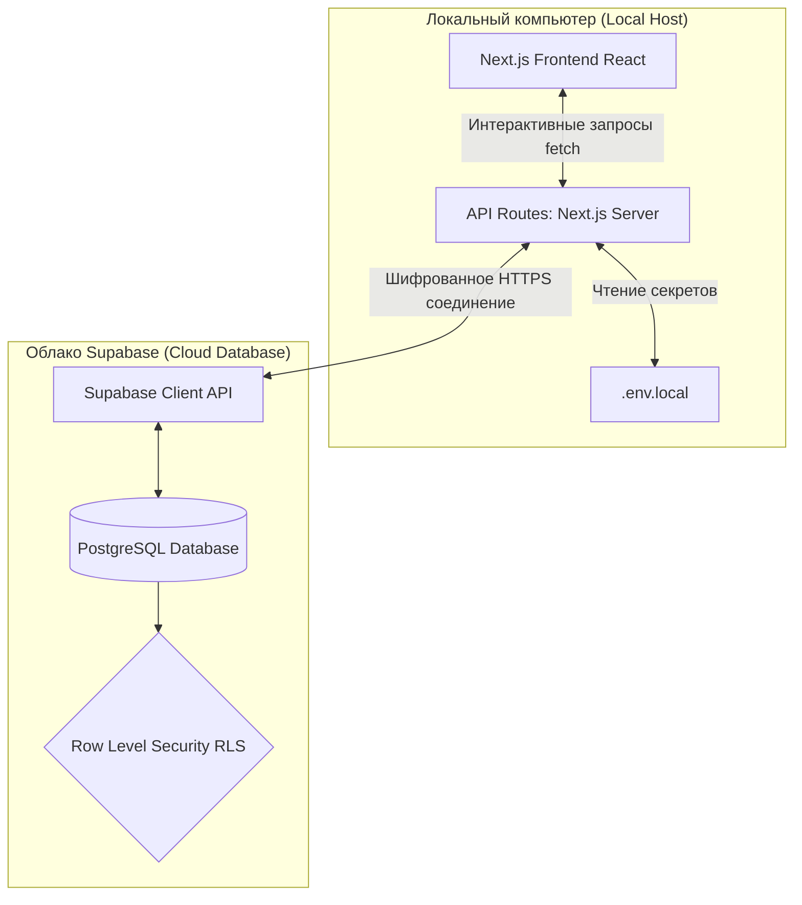

# 🌐 Подключение локального приложения к Supabase (docs/supabase/local-connect.md)

В рамках разработки терминала **SafeTrade Analytics** мы настроили архитектуру обмена данными между локальным веб-приложением на Next.js (клиент и серверные маршруты) и удаленной облачной базой данных **Supabase (PostgreSQL)**.

---

## 🏗️ Схема разделения сред (Локально vs Удаленно)



1. **Локальное приложение**: Next.js-приложение запускается на локальном порту (например, `http://localhost:3000`).
2. **Удаленная база данных**: База данных PostgreSQL развернута на облачных серверах Supabase в Европе для максимальной скорости работы с биржами.
3. **Безопасное соединение**: Локальный сервер общается с Supabase с помощью SDK `@supabase/supabase-js`, используя ключи из файла `.env.local`.

---

## 🔒 Безопасность и управление ключами (`.env` файлы)

Для защиты критических данных и предотвращения утечек на GitHub мы строго разделили файлы конфигурации:

1. **`.env.local`** (Локальные приватные ключи):
   * Содержит настоящие URL-адреса и ключи доступа к базе.
   * **КРИТИЧЕСКИ ВАЖНО:** Этот файл занесен в `.gitignore` (правило `.env*`) и никогда не попадет в публичный репозиторий.
2. **`.env.example`** (Публичный шаблон):
   * Находится в корне проекта `app-code/.env.example`.
   * Содержит только пустые структуры ключей без паролей, чтобы любой разработчик понимал структуру проекта.

---

## 📊 Описание базы данных: Главная таблица `trades` (Сделки)

Для реализации аналитического дашборда нашему проекту нужна таблица учета закрытых сделок:

### Структура таблицы `trades` (PostgreSQL)

| Имя колонки | Тип данных | Описание |
| :--- | :--- | :--- |
| `id` | `UUID` (Primary Key) | Уникальный идентификатор сделки. |
| `user_id` | `UUID` (Foreign Key) | Связь с таблицей `users` для разграничения прав доступа. |
| `asset` | `VARCHAR` | Торговый инструмент (например, `BTC`, `ETH`, `SPUS`, `GOLD`). |
| `direction` | `VARCHAR` | Направление сделки (`BUY` / `SELL`). |
| `entry_price` | `NUMERIC` | Цена входа в сделку. |
| `exit_price` | `NUMERIC` | Цена выхода из сделки. |
| `stop_loss` | `NUMERIC` | Цена установленного Стоп-Лосса. |
| `take_profit` | `NUMERIC` | Цена Тейк-Профита. |
| `profit_loss` | `NUMERIC` | Финансовый результат сделки в EUR (прибыль или убыток). |
| `slippage` | `NUMERIC` | Проскальзывание и комиссии сети в EUR. |
| `timestamp` | `TIMESTAMPTZ` | Время фиксации сделки на сервере (default: `now()`). |

### 🛡️ Row Level Security (RLS) в Supabase
Для защиты балансов пользователей на уровне СУБД включена политика RLS:
```sql
ALTER TABLE trades ENABLE ROW LEVEL SECURITY;

CREATE POLICY "Users can only read and write their own trades" 
ON trades FOR ALL 
TO authenticated 
USING (auth.uid() = user_id);
```
Это гарантирует, что каждый авторизованный пользователь может видеть и изменять только свои собственные сделки, предотвращая любой несанкционированный доступ.
