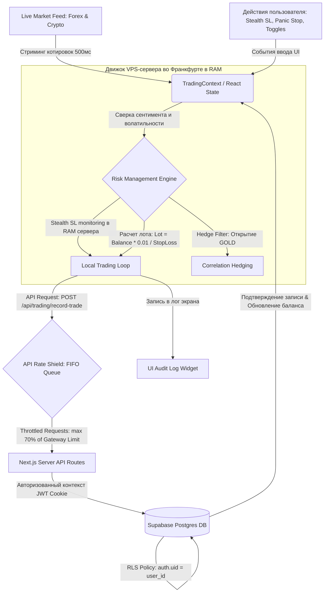

# Data Flow Specification: SafeTrade Analytics
## Спецификация потоков данных и жизненного цикла транзакций

Этот документ описывает, как данные поступают, обрабатываются, защищаются и сохраняются в системе **SafeTrade Analytics**. Он является главным архитектурным описанием маршрутизации данных между удаленными серверами Next.js (VPS во Франкфурте), торговым ядром (выполняемым в RAM сервера), клиентской панелью управления (браузером пользователя) и облачной СУБД Supabase.

---

## 🗺️ 1. Глобальная схема движения данных (Data Flow Diagram)

Ниже представлена визуальная архитектура движения информации в приложении:

---

## 🔀 2. Четыре уровня данных в системе

Для исключения неопределенности в архитектуре, данные в SafeTrade Analytics строго делятся на четыре категории:

### А. Входные внешние данные (External Inputs)
Данные, поступающие в систему из внешних источников в режиме реального времени:
1. **Котировки (Live Feed):** Текущие цены Форекс (EURUSD), Сырья (GOLD) и Криптовалют (BTC, ETH) обновляются каждые 500мс.
2. **Макро-индикаторы и объемы (Whale Flows):** Поток транзакций крупных игроков (Volume, Order Book Depth) и значение сентимента (Sentiment Confidence %) для принятия решений.
3. **Новостные сигналы (News Feed):** Флаги наступления Tier-1 новостей (например, CPI, решение ФРС по ставкам) для работы News Shield.

### Б. Ввод пользователя (User Inputs)
Параметры, которые трейдер настраивает вручную на панели управления:
1. **Stealth SL Slider:** Выбранный процент скрытого стоп-лосса (от 3.0% до 5.0%).
2. **Hedge Filter Toggle:** Включение/выключение компенсационной защиты золотом.
3. **Momentum Scalp Toggle:** Включение/выключение режима скальпинга на микро-импульсах.
4. **Panic Stop Button:** Экстренное прерывание всех торгов и принудительное закрытие всех сделок.
5. **Bypass EOD Halt Button:** Временное переопределение ночной блокировки торговли.

### В. Вычисляемые параметры (Calculated Parameters)
Параметры, которые рассчитываются торговым ядром автоматически на основе математических формул:
1. **Размер лота (Lot Size):** Рассчитывается при открытии сделки по формуле:
    $$\text{Размер Лота} = \frac{\text{Баланс} \times 0.01}{\text{Дистанция Стоп-Лосса}}$$
2. **Emergency Visible Stop-Loss:** Уровень аварийного стоп-лосса на бирже:
    $$\text{Emergency SL} = \text{Stealth SL (Slider)} + 2.0\%$$
3. **Alpha Index (Рейтинг сессии):** Успешность текущей торговой сессии:
    $$\text{Alpha Index} = \frac{\text{Текущая прибыль}}{\text{Дневной лимит}} \times 10$$
4. **Текущий плавающий результат (Live Float / profit):** Прибыль или убыток по сделке в текущую секунду на основе разницы цен входа и текущей рыночной котировки.
5. **Состояние очереди API Rate Shield (`apiLoadState`):** Статус пропускной способности API на основе плотности запросов.

### Г. Хранимые данные (Persisted Data)
Данные, которые отправляются на сервер и сохраняются в облачную базу данных Supabase:
1. **Сессии пользователей (Auth Session):** JWT-токены, управляемые Supabase Auth и сохраненные в HttpOnly Cookies.
2. **Таблица `trades` (Сделки):** `trade_id`, `user_id` (владелец), `asset` (актив), `direction` (BUY/SELL), `entry_price` (цена входа), `exit_price` (цена выхода), `profit_loss` (финансовый итог сделки в EUR), `timestamp` (UTC).
3. **Таблица `system_logs` (Логи системы):** Системные события для отладки (`EMERGENCY_HALT`, `EOD_BYPASS_WARNING`, `CIRCUIT_BREAKER_TRIGGERED`).

---

## 🔄 3. Пошаговый Жизненный Цикл Данных (Data Lifecycle Steps)

### Шаг 1: Авторизация и доступ (Session Ingestion)
* **Вход:** Пользователь вводит email и пароль на странице `/admin/login`.
* **Обработка:** Supabase Auth валидирует данные, генерирует сессионный JWT-токен. Токен сохраняется в Cookies.
* **Результат:** Middleware (`middleware.ts`) проверяет куки. Если токен валиден, открывается доступ к `/admin`. Вся база данных закрыта политикой RLS: запросы без JWT или с чужим ID будут отклонены СУБД на уровне ядра PostgreSQL.

### Шаг 2: Инициализация терминала (Terminal Ingestion)
* **Вход:** Рендеринг страницы `/admin` инициализирует хук `useTradingState`.
* **Обработка:** Клиент делает стартовый GET-запрос к базе данных Supabase для загрузки истории сделок и текущего баланса пользователя. Данные записываются в React State.
* **Результат:** На экране отображается реальный баланс (например, **5000.00 EUR**), и запускаются тактовые серверные генераторы котировок (каждые 500мс).

### Шаг 3: Сканирование рынка и генерация сигнала (Signal Detection)
* **Вход:** Живой поток котировок (Forex & Crypto) и Sentiment Confidence поступают в RAM сервера.
* **Обработка:** Система проверяет, равен ли показатель Sentiment Confidence установленной норме:
  * Если Дневная цель не достигнута: порог входа $\ge 75\%$.
  * Если Дневная цель достигнута: активируется **Greed Lock**, порог входа поднимается до $\ge 80\%$.
* **Результат:** Если условия соблюдены (и нет блокировки по новостям или Circuit Breaker), генерируется триггер на вход в сделку.

### Шаг 4: Расчет риска и отправка сделки (Risk Calculation & Rate Shielding)
* **Вход:** Сигнал на покупку по BTC по цене 60,000 EUR.
* **Обработка:** 
  1. Рассчитывается объем лота (риск ровно 1% от баланса).
  2. Рассчитывается уровень Stealth SL (например, 3% = 58,200 EUR) и Emergency Visible SL (Stealth SL + 2% = 5% = 57,000 EUR).
  3. Запрос на отправку ордера фрагментируется на микро-лоты (Stealth Mode) и помещается в FIFO-очередь **API Rate Shield**.
  4. Ордера выходят из очереди с динамической задержкой (рассчитывается на уровне 70% от лимита активного шлюза).
* **Результат:** Сделка отправляется на сервер и открывается.

### Шаг 5: Мониторинг сделки и закрытие (Trade Loop Monitoring)
* **Вход:** Котировка BTC снижается до 58,200 EUR.
* **Обработка:**
  1. Удаленное серверное ядро во Франкфурте видит достижение Stealth SL (3.0%) в RAM.
  2. Сервер мгновенно отправляет рыночный ордер `Market Sell` на закрытие сделки.
  3. Сервер формирует POST-запрос на `/api/trading/record-trade` с финансовым результатом сделки, динамической ценой входа (`entry_price` на основе текущей котировки торгуемого актива: BTC, ETH, GOLD, TSLA, SPUS, EURUSD, NDX) и ценой выхода (`exit_price`, рассчитанной пропорционально изменению баланса от сделки).
* **Результат:** Сделка закрыта. Информация записывается в Supabase с корректными ценами активов. Баланс пользователя в React State уменьшается.

### Шаг 6: Фиксация лимита дневных потерь (Circuit Breaker Trigger)
* **Вход:** После фиксации убытка, API проверяет сумму потерь за текущие сутки (в часовом поясе `Europe/Brussels`).
* **Обработка:** 
  1. Суммарный дневной убыток достиг лимита (1% от баланса).
  2. Серверный API-эндпоинт активирует предохранитель `Circuit Breaker` и блокирует торговлю.
* **Результат:** Торги блокируются. Все кнопки входа в сделки на UI становятся неактивными, а блокировка сохраняется строго до 09:00 CET следующего дня, когда EOD Reset автоматически снимет ограничение.

---

## 4. СТАБИЛЬНОСТЬ ИНТЕРВАЛОВ И ОПТИМИЗАЦИЯ ПАМЯТИ (ENGINE INTERVAL STABILITY)
Для поддержания непрерывности симуляции котировок и предотвращения микро-лагов при переключении пользовательских настроек в браузере:
- **Использование стабильных ссылок (Refs):** Переменные состояния, часто переключаемые пользователем (например, `isStealth` или `threatLevel`), внутри функций фиксации и симуляции (`realizeProfitAction`) должны отслеживаться через стабильные ссылки `useRef`.
- **Предотвращение сброса таймеров:** Функции обратного вызова симулятора котировок не должны пересоздаваться при изменении этих настроек. Запрещается указывать динамически переключаемые переменные состояния в массивах зависимостей (`useEffect` / `useCallback`), привязанных к интервалам симуляции. Это гарантирует, что 2-секундный таймер симуляции не будет сбрасываться и зависать при быстром кликании по интерфейсу.
вход в сделку.

### Шаг 4: Расчет риска и отправка сделки (Risk Calculation & Rate Shielding)
* **Вход:** Сигнал на покупку по BTC по цене 60,000 EUR.
* **Обработка:** 
  1. Рассчитывается объем лота (риск ровно 1% от баланса).
  2. Рассчитывается уровень Stealth SL (например, 3% = 58,200 EUR) и Emergency Visible SL (Stealth SL + 2% = 5% = 57,000 EUR).
  3. Запрос на отправку ордера фрагментируется на микро-лоты (Stealth Mode) и помещается в FIFO-очередь **API Rate Shield**.
  4. Ордера выходят из очереди с динамической задержкой (рассчитывается на уровне 70% от лимита активного шлюза: например, 142мс для лимита 10/сек, 28мс для лимита 50/сек). Статус API на панели переходит в `QUEUED`.
* **Результат:** Сделка отправляется на сервер и открывается.

### Шаг 5: Мониторинг сделки и закрытие (Trade Loop Monitoring)
* **Вход:** Котировка BTC снижается до 58,200 EUR.
* **Обработка:**
  1. Локальный скрипт мониторинга в RAM видит достижение Stealth SL (3.0%).
  2. Скрипт мгновенно отправляет рыночный ордер `Market Sell` на закрытие сделки.
  3. Клиент формирует POST-запрос на `/api/trading/record-trade` с финансовым результатом сделки, динамической ценой входа (`entry_price` на основе текущей котировки торгуемого актива: Gold, TSLA, SPUS, EURUSD, NDX, BTC) и ценой выхода (`exit_price`, рассчитанной пропорционально изменению баланса от сделки).
* **Результат:** Сделка закрыта. Информация записывается в Supabase с корректными ценами активов. Баланс пользователя в React State уменьшается.

### Шаг 6: Фиксация лимита дневных потерь (Circuit Breaker Trigger)
* **Вход:** После фиксации убытка -50.00 EUR, API проверяет сумму потерь за текущие сутки.
* **Обработка:** 
  1. Суммарный дневной убыток достиг 1% от баланса (-50 EUR).
  2. Серверный API-эндпоинт активирует предохранитель `Circuit Breaker` и записывает событие блокировки.
* **Результат:** Торги блокируются на 24 часа. Все кнопки входа в сделки на UI становятся неактивными, индикатор защиты горит красным, а в лог выводится сообщение `SECURITY HALT: Daily loss limit reached`.

---

## 4. СТАБИЛЬНОСТЬ ИНТЕРВАЛОВ И ОПТИМИЗАЦИЯ ПАМЯТИ (ENGINE INTERVAL STABILITY)
Для поддержания непрерывности симуляции котировок и предотвращения микро-лагов при переключении пользовательских настроек в браузере:
- **Использование стабильных ссылок (Refs):** Переменные состояния, часто переключаемые пользователем (например, `isStealth` или `threatLevel`), внутри функций фиксации и симуляции (`realizeProfitAction`) должны отслеживаться через стабильные ссылки `useRef` (например, `isStealthRef.current`, `threatLevelRef.current`).
- **Предотвращение сброса таймеров:** Функции обратного вызова симулятора котировок не должны пересоздаваться при изменении этих настроек. Запрещается указывать динамически переключаемые переменные состояния в массивах зависимостей (`useEffect` / `useCallback`), привязанных к интервалам симуляции. Это гарантирует, что 2-секундный таймер симуляции не будет сбрасываться и зависать при быстром кликании по интерфейсу.

