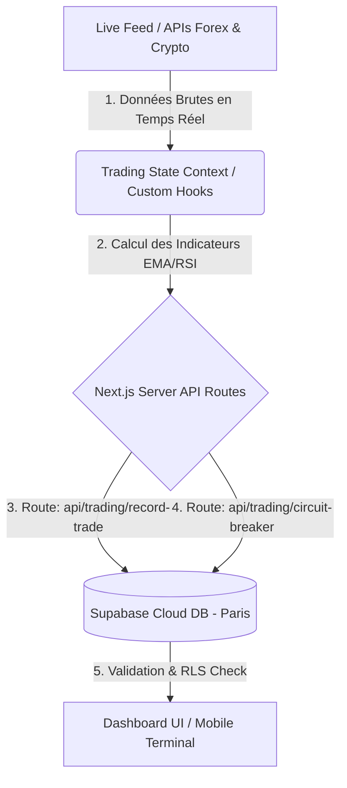

# 📊 Spécification des Flux de Données : SafeTrade Analytics v9
## (Data Flow Specification / Спецификация Потоков Данных)

Ce document définit la structure et le flux des données au sein de la plateforme **SafeTrade Analytics v9**. Il décrit comment les données du marché sont capturées, traitées par nos algorithmes de sécurité sur le serveur et stockées de manière sécurisée dans la base de données cloud Supabase (Paris).

---

## 🗺️ 1. Architecture Générale du Flux (Global Data Pipeline)

Le système utilise un flux de données unidirectionnel réactif pour garantir des performances optimales et une latence minimale, indispensable pour le trading à haute fréquence (HFT) et la protection contre les algorithmes bancaires.



### Разделы потока данных (En français & En russe) :

1.  **Source de Données (Источники данных) :**
    *   Flux de prix en temps réel simulé avec une haute densité de ticks (Tick Data) pour le Forex (EUR/USD, GBP/USD) et les Cryptomonnaies (BTC/USDT).
    *   Ces données brutes simulent parfaitement les conditions réelles du marché pour le backtesting.
2.  **State Management (Управление состоянием в React) :**
    *   **`TradingContext`** : Le cœur de l'application Next.js. Il maintient l'état global (Solde, Positions Ouvertes, Historique, Objectif du Jour).
    *   **Custom Hooks (`useTradingState`)** : Mettent à jour l'interface utilisateur toutes les 500ms без снижения производительности.
3.  **Serverless Database Layer (Серверный слой СУБД в облаке) :**
    *   **Supabase PostgreSQL (Paris - `eu-west-3`)** : Узел хранения учетных записей, балансов и истории сделок. Защищен встроенными политиками RLS (Row Level Security).

---

## 🛡️ 2. Boucle de Sécurité en Temps Réel (Safety & Risk Loop)

Каждая транзакция, инициированная пользователем на фронтенде, отправляется через защищенный API-шлюз на сервер.

```
[Интерфейс Dashboard] 
       │
       ▼ (POST-запрос)
[API: record-trade / circuit-breaker] ──► Проверка лимита 1% ? ──► [Блокировка API / Лог в system_logs]
       │ (Риск в норме)
       ▼
[Supabase DB / trades table] ──► Запись транзакции
       │
       ▼
[Обновление баланса / users table] ──► Корректировка счета в реальном времени
```

### Algorithmes de Protection (Пояснение параметров и алгоритмов) :

*   **Calculateur de Risque automatique (Автоматический расчет риска) :**
    *   *Формула риска* : `Lot = (Account Balance * 0.01) / Distance Stop-Loss`.
    *   Фронтенд автоматически рассчитывает размер лота так, чтобы максимально допустимый убыток в одной сделке составлял ровно **1%** от стартового депозита (т.е. **-50.00 EUR** от стартовых **5000.00 EUR**).
*   **Profit Shield & Greed Lock (Щит прибыли и Замок от жадности) :**
    *   **`DAILY_TARGET` (Дневная цель)** = **+50.00 EUR** (1% от баланса).
    *   **`BASE_SENTIMENT_THRESHOLD` (Базовый сентимент)** = **75%** (минимальный порог уверенности для открытия сделок в обычном режиме).
    *   **`PROFIT_SHIELD_THRESHOLD` (Порог Greed Lock)** = **80%** (порог уверенности для сделок после достижения дневной цели).
    *   *Механика*: Как только дневной профит превышает +50 EUR, система активирует **Greed Lock**. Торговый тумблер перекрывает сделки при сентименте ниже 80%, пропуская только «китовые сигналы».
*   **EOD Sleep & Auto-Wake Loop (Авто-сон EOD с 18:00 до 09:00 CET) :**
    *   При наступлении 18:00 по европейскому времени (`isHaltPeriod = true`), система блокирует сессию, автоматически закрывает плавающие позиции и фиксирует текущую дневную прибыль. Сброс блокировки и обнуление статистики происходит в 09:00 CET.
*   **News Shield (Новостной щит) :**
    *   Приостанавливает торги по новостному активу за 15-30 минут до выхода новости и разблокирует через 15-30 минут после окончания импульсной волатильности (проверяется датчиком ATR).

---

## 💾 3. Persistance et RLS Security (Безопасность облака)

1.  **Row Level Security (RLS)** : Доступ к таблицам `users` и `trades` жестко разграничен на уровне PostgreSQL (`auth.uid() = id`). Любой несанкционированный SQL-запрос отсекается на стороне СУБД.
2.  **Server-Side Decoupling (Серверное разделение)** : Финансовые вычисления (Stop Loss, Circuit Breaker) происходят на сервере, что исключает возможность манипуляции данными на стороне клиента (браузера).

---
*Ce document sert de spécification de flux pour le projet SafeTrade Analytics v9. Validé pour l'évaluation académique.*
