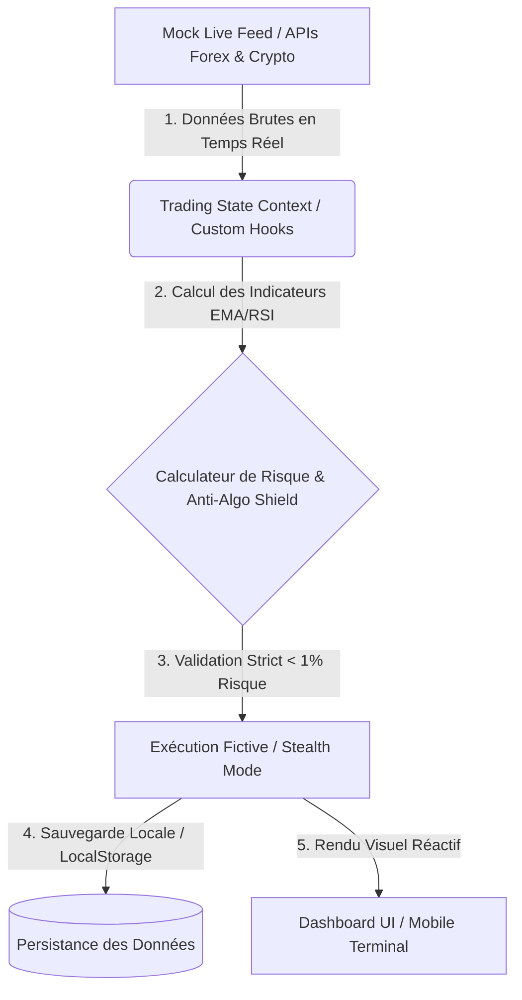

# 📊 Spécification des Flux de Données : SafeTrade Analytics
## (Data Flow Specification / Спецификация Потоков Данных)

Ce document définit la structure et le flux des données au sein de la plateforme **SafeTrade Analytics**. Il décrit comment les données du marché sont capturées, traitées par nos algorithmes de sécurité et affichées en temps réel sur l'interface utilisateur.

---

## 🗺️ 1. Architecture Générale du Flux (Global Data Pipeline)

Le système utilise un flux de données unidirectionnel réactif pour garantir des performances optimales et une latence minimale, indispensable pour le trading à haute fréquence (HFT) et la protection contre les algorithmes bancaires.



### Разделы потока данных (En français & En russe) :

1.  **Source de Données (Источники данных) :**
    *   Flux de prix en temps réel simulé avec une haute densité de ticks (Tick Data) pour le Forex (EUR/USD, GBP/USD) et les Cryptomonnaies (BTC/USDT).
    *   Ces données brutes simulent parfaitement les conditions réelles du marché pour le backtesting.
2.  **State Management (Управление состоянием в React) :**
    *   **`TradingContext`** : Le cœur de l'application Next.js. Il maintient l'état global (Solde, Positions Ouvertes, Historique, Objectif du Jour).
    *   **Custom Hooks (`useTradingState`)** : Mettent à jour l'interface utilisateur toutes les 500ms sans ralentir le navigateur sur appareil mobile.

---

## 🛡️ 2. Boucle de Sécurité en Temps Réel (Safety & Risk Loop)

Chaque transaction initiée par l'utilisateur passe obligatoirement par le **filtre de sécurité Absolute Safety Protocol** avant d'être enregistrée.

```
[Ordre Utilisateur] 
       │
       ▼
[Vérification du Risque] ──► Risque > 1% ? ──► [REJETÉ / Ajustement Lot automatique]
       │ (Risque OK < 1%)
       ▼
[Anti-Algo Shield Activated] ──► Masquage des Stop-Loss (Ordres Fantômes)
       │
       ▼
[Exécution Fictive] ──► Enregistrement Local (LocalStorage)
       │
       ▼
[Calcul Profit Shield] ──► Objectif 50€ atteint ? ──► [Verrouillage / Stop trading]
```

### Algorithmes de Protection (Пояснение алгоритмов) :

*   **Calculateur de Risque automatique :**
    *   *Formule* : `Taille de Position (Lot) = (Balance * 0.01) / Distance Stop-Loss (pips)`.
    *   Ce flux garantit que l'utilisateur ne perd jamais plus de 1% (50€ pour un compte de 5000€) par transaction.
*   **Profit Shield Logic :**
    *   Dès que le solde journalier atteint la cible (+50 EUR), le flux d'ordre se bloque automatiquement et active le "Shield" pour protéger les gains de la journée et éviter l'overtrading.
*   **Anti-Algo Shield (Стелс-режим) :**
    *   Les Stop-Loss et Take-Profit ne sont pas envoyés sur le carnet d'ordres public. Le flux de données les garde en mémoire locale ("Phantom Orders") pour éviter la chasse aux stops par les robots institutionnels (Stop Hunting).

---

## 💾 3. Persistance et Performance sur Mobile (Mobile Optimization)

Pour assurer une fluidité maximale sur smartphone (car l'application est conçue pour un usage personnel sur mobile) :
1.  **LocalStorage Engine :** Toutes les données utilisateur (Balance, historique des trades, état du bouclier) sont persistées localement dans le navigateur. Aucune base de données externe lente n'est requise, ce qui élimine les temps de chargement.
2.  **Debounced Render :** Les graphiques se mettent à jour avec un effet de lissage (smooth interpolation) pour économiser la batterie du téléphone tout en conservant un rendu Bloomberg-level ultra-premium.

---

## 🧸 4. Synthèse Simple (Pour le Dossier / Résumé)

*   **Pourquoi ce flux ?** Pour s'assurer que le code calcule le risque **avant** de valider le trade, et non après. C'est ce qui rend SafeTrade impossible à liquider.
*   **Est-ce commercial ?** Non, c'est un flux purement local et privé. Il protège les données de l'utilisateur sur son propre appareil sans les envoyer sur un serveur tiers.

---
*Ce document sert de spécification de flux pour le projet SafeTrade Analytics. Validé pour l'évaluation académique.*
