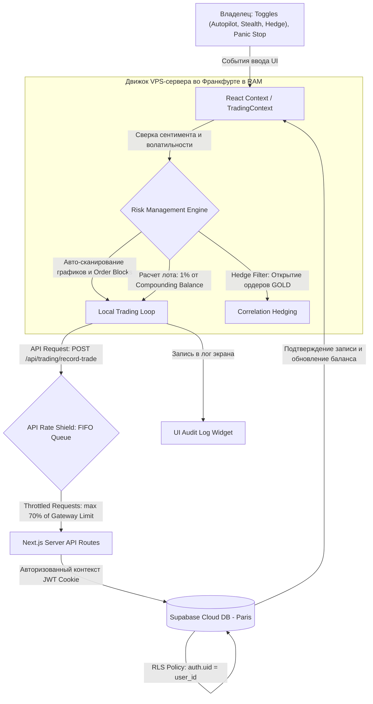

# Technical Specification: Data Flow & State Management
## Спецификация движения данных и управления состоянием

Этот документ описывает схему реактивных потоков данных, архитектуру состояний React и порядок синхронизации с облачной базой данных Supabase в терминале **SafeTrade Analytics**.

---

## 🗺️ 1. Архитектурная схема потоков данных (Data Architecture)

Все вычисления и хранение ордеров в Stealth Mode выполняются на удаленном VPS-сервере во Франкфурте (в RAM). Клиентская панель служит для настройки параметров и визуализации логов.

---

## 🔄 2. Четыре уровня данных в системе

Для исключения неопределенности в архитектуре, данные в SafeTrade Analytics строго делятся на четыре категории:

### А. Входные внешние данные (External Inputs)
Данные, поступающие в систему из внешних источников в режиме реального времени:
1. **Котировки (Live Feed):** Текущие цены Форекс (EURUSD), сырья (GOLD), акций (TSLA, SPUS) и криптовалют (BTC, ETH, NDX) обновляются каждые 500мс.
2. **Макро-индикаторы и объемы (Whale Flows):** Поток транзакций крупных игроков (Volume, Order Book Depth) и значение сентимента (Sentiment Confidence %) для принятия решений.
3. **Новостные сигналы (News Feed):** Флаги наступления Tier-1 новостей (CPI, решение ФРС по ставкам) для работы News Shield.

### Б. Ввод пользователя (User Inputs)
Параметры, которые владелец настраивает вручную на панели управления для корректировки автопилота:
1. **Autopilot Toggle:** Включение/выключение автоторговли (`isAutotrade`).
2. **Stealth SL Slider:** Выбранный процент скрытого стоп-лосса (от 3.0% до 5.0%).
3. **Hedge Filter Toggle:** Включение/выключение компенсационной защиты золотом.
4. **Momentum Scalp Toggle:** Включение/выключение режима скальпинга на микро-импульсах.
5. **Panic Stop Button:** Экстренное принудительное закрытие всех сделок и перевод в режим ожидания.
6. **Bypass EOD Halt Button:** Разрешение автопилоту торговать в ночное время и выходные.

### В. Вычисляемые параметры (Calculated Parameters)
Параметры, которые рассчитываются торговым ядром автоматически в RAM:
1. **Размер лота (Lot Size):** Рассчитывается при открытии сделки по формуле:
    $$\text{Размер Лота} = \frac{\text{Баланс} \times 1\%}{\text{Дистанция Стоп-Лосса}}$$
2. **Emergency Visible Stop-Loss:** Уровень аварийного стоп-лосса на бирже:
    $$\text{Emergency SL} = \text{Stealth SL} + 2.0\%$$
3. **Alpha Index (Рейтинг сессии):** Успешность текущей торговой сессии по шкале от 0 до 10+:
    $$\text{Alpha Index} = \frac{\text{Текущая прибыль}}{\text{Дневной лимит}} \times 10$$
4. **Текущий плавающий результат (Live Float):** Нереализованный финансовый результат по открытой сделке.

### Г. Хранимые данные (Persisted Data)
Данные, записываемые в Supabase PostgreSQL и сохраняемые между сессиями:
1. **Балансы владельца:** Таблица `users`, защищенная RLS-политиками.
2. **История сделок:** Таблица `trades` (дата, актив, тип сделки, цены `entry_price` и `exit_price`, финансовый результат PnL).
3. **Журнал событий:** Таблица `system_logs` (аудит безопасности, предупреждения Cooldown, EOD Bypass).

---

## 🏃‍♂️ 3. Пошаговые сценарии движения данных (Step-by-Step Data Flow)

### Шаг 1: Инициализация терминала и сессии
* **Вход:** Авторизация пользователя на странице `/admin/login` через Supabase Auth.
* **Обработка:** Middleware (`middleware.ts`) проверяет JWT-токен в Cookies. В случае валидности загружается страница `/admin/page.tsx` и инициализируется `TradingContext`. Из базы данных запрашивается текущий баланс пользователя.
* **Результат:** На экране отображается реальный баланс, и запускается серверный симулятор котировок.

### Шаг 2: Получение котировок и расчет сентимента
* **Вход:** Стриминг котировок 7 активов с частотой 500мс.
* **Обработка:** Для каждого тика сервер вычисляет рыночный импульс (`Market Pulse %` / Sentiment) на основе глубины стакана и коэффициента активности ATR.
* **Результат:** Значения выводятся на виджеты Macro Intelligence. Если Sentiment > 75% (или 80% при активном Greed Lock), система готова к автоматическому входу.

### Шаг 3: Автоматическое сканирование рынка и генерация входов
* **Вход:** Включение тумблера `Autopilot` (`isAutotrade = true`).
* **Обработка:** Алгоритм в RAM сканирует таймфреймы H4 (определяя глобальный тренд) и M15 (выявляя Order Blocks). При совпадении тренда, Sentiment и касания цены ордерблока на M15, система ищет BOS/MSS на младшем таймфрейме (M1/M5) для авто-входа.
* **Результат:** Принимается решение об открытии автоматической сделки (BUY или SELL).

### Шаг 4: Расчет риска и отправка сделки (Risk Calculation & API Rate Shield)
* **Вход:** Сигнал на вход по BTC от автопилота.
* **Обработка:**
  1. Рассчитывается лот под риск ровно 1% от Compounding Balance.
  2. Рассчитываются уровни Stealth SL (локальный RAM) и Emergency Visible SL (отправляется брокеру).
  3. Запрос фрагментируется на микро-лоты в Stealth Mode и помещается в FIFO-очередь Rate Shield.
  4. Ордера отправляются с джиттером (100-350мс) и задержкой 142мс (для крипты, лимит 12 ордеров в RAM) или 28мс (для Forex, лимит 45 ордеров в RAM), сохраняя 70% безопасность от ограничений брокера.
* **Результат:** Сделка успешно открывается, на UI выводится статус `API GATEWAY: OK` (или `QUEUED` при высокой нагрузке).

### Шаг 5: Мониторинг сделки и закрытие (Trade Loop Monitoring)
* **Вход:** Изменение текущей цены актива.
* **Обработка:**
  1. Сервер/клиент сверяет текущую цену с уровнем Stealth SL. При достижении лимита позиция закрывается.
  2. **Для реальных сделок:** Клиент отправляет POST-запрос на `/api/trading/record-trade`. Цены входа и выхода рассчитываются динамически, результат фиксируется в Supabase DB, баланс обновляется в базе.
  3. **Для симулируемых сделок:** Закрытие происходит исключительно локально в памяти клиента (in-memory React State). Никакие запросы к `/api/trading/record-trade` не отправляются, база данных остается чистой.
* **Результат:** Реальная сделка зафиксирована в Supabase, симулируемая сделка завершена в памяти браузера без влияния на БД.

### Шаг 6: Фиксация лимита дневных потерь (Circuit Breaker Trigger)
* **Вход:** Новая сделка добавлена в Supabase, или сработал интервальный запрос.
* **Обработка:** Серверный эндпоинт `/api/trading/circuit-breaker` запрашивает из базы данных Supabase сумму реализованных убытков по таблице `trades` за текущие сутки (начиная с 09:00 CET). Если сумма убытков $\ge 1.0\%$ от баланса, активируется блокировка Circuit Breaker.
* **Результат:** Реальная торговля блокируется до сброса в 09:00 CET следующего дня. Симулируемые сделки не влияют на Circuit Breaker, так как не записываются в базу данных.

---

## ⚡ 4. Стабильность интервалов и оптимизация памяти (Engine Interval Stability)
Для поддержания непрерывности симуляции котировок и предотвращения микро-лагов при переключении пользовательских настроек в браузере:
- **Использование стабильных ссылок (Refs):** Переменные состояния, часто переключаемые пользователем (например, `isStealth` или `threatLevel`), внутри функций фиксации и симуляции (`realizeProfitAction`) должны отслеживаться через стабильные ссылки `useRef` (например, `isStealthRef.current`, `threatLevelRef.current`).
- **Предотвращение сброса таймеров:** Функции обратного вызова симулятора котировок не должны пересоздаваться при изменении этих настроек. Запрещается указывать динамически переключаемые переменные состояния в массивах зависимостей (`useEffect` / `useCallback`), привязанных к интервалам симуляции. Это гарантирует, что таймер симуляции не будет сбрасываться и зависать при быстром кликании по интерфейсу.
