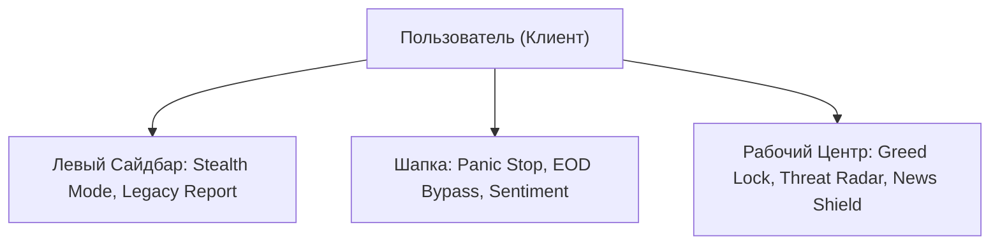

# 🗺️ ФУНКЦИОНАЛЬНАЯ СУПЕР-КАРТА И ГИД ПО ИНТЕРФЕЙСУ: SafeTrade Analytics v9
## Мастер-Спецификация всех элементов управления, кнопок и виджетов
### Статус документа: Утвержденная академическая спецификация (DoD-Aligned)

Этот документ является «источником истины» для графического интерфейса пользователя (GUI) терминала **SafeTrade Analytics v9**. Любая кнопка, виджет или панель, присутствующая в программном коде Next.js (`app-code/app/page.tsx`), жестко зафиксирована здесь с детальным описанием технического функционала, серверных триггеров и физики работы.

---

## 1. 🗂️ ОБЩАЯ СТРУКТУРА МАКЕТА ТЕРМИНАЛА
Интерфейс спроектирован по принципу модульного терминала Bloomberg с глубоким темным фоном (`#0a0a0b`), стеклянными эффектами (backdrop-blur) и неоновым свечением состояний:
1.  **Sidebar (Левая навигационная панель):** Брендинг, переключатели экранов, показатели стабильности и кнопка Stealth.
2.  **Header (Шапка управления):** Системные тумблеры (Panic Stop, EOD Bypass), индикаторы уверенности алгоритма и оценка портфеля.
3.  **Main Area (Центральная рабочая зона):**
    *   *Главный монитор:* Ассетная оценка, статус безопасности (Greed Lock) и Threat-радар.
    *   *Audit Log:* Лента событий реального времени.
    *   *Whale Activity Monitor:* Потоки банковских объемов.
    *   *Macro Intelligence:* Секторальные карты активов и News Shield.

---

## 2. 🎛️ ДЕТАЛЬНОЕ ТЕХНИЧЕСКОЕ ОПИСАНИЕ КНОПОК И ОПЦИЙ

### 🎚️ А. Левая Панель (Sidebar Controls)
*   **Логотип / Брендинг (`TrendingUp` + SafeTrade):** Статичный элемент визуализации бренда системы.
*   **Кнопка «Terminal» (NavItem):** Переключает терминал в режим живого стриминга графиков и торгов в реальном времени (`showHistory = false`).
*   **Кнопка «Legacy Report» (NavItem):** Открывает детальный исторический аудит-отчет за 10 лет (2016-2026), заменяя живой график аналитическими картами.
*   **Виджет «Green Streak» (Иконка Trophy):** Счетчик непрерывных прибыльных торговых сессий (`greenDaysStreak`). Мотивирует трейдера соблюдать дисциплину.
*   **Виджет «Stability» (Иконка Stability + Progress Bar):** Индикатор стабильности торговой эффективности алгоритма в процентах (`efficiency`). Показывает качество исполнения сделок.
*   **Кнопка-тумблер «Stealth Mode» (Иконка Ghost + Switch):**
    > [!IMPORTANT]
    > **Технический функционал Stealth Mode:**  
    > Когда Stealth активен (`isStealth = true`), параметры Stop-Loss и Take-Profit **не отправляются на публичную биржу** и отсутствуют в общем биржевом стакане. Они хранятся исключительно в скрытой локальной памяти сервера во Франкфурте (Phantom Orders). Это предотвращает манипулятивную «охоту за стопами» (Stop-Hunting) розничных трейдеров со стороны HFT-роботов маркетмейкеров. При отключении режима стопы отправляются на биржу стандартным образом.
*   **Слайдер «Stealth Stop-Loss» (Регулятор Скрытого Стопа):**
    *   *Назначение:* Ручной регулятор максимального потолка риска для Скрытого Стоп-Лосса (диапазон от **3.0% до 5.0%** с шагом 0.5%).
    *   *По умолчанию:* Установлен на **3.0%** (самое безопасное и исторически проверенное значение).
    *   *Логика:* Если ИИ видит сделку с рисками больше выбранного лимита, он автоматически отменяет вход.
*   **Виджет «Emergency Visible SL» (Аварийный Публичный Стоп-Лосс):**
    *   *Назначение:* Отображает динамический расчет уровня экстренного стоп-лосса на бирже по формуле: **«Выбранный скрытый стоп-лосс + 2.0%»**.
    *   *Логика:* Автоматически отправляется на биржу как жесткий резерв. Если скрытый стоп установлен на 3.0%, аварийный будет 5.0%.
*   **Тумблер «Hedge Filter» (Иконка ShieldCheck + Switch):**
    *   *Назначение:* Рубильник активации защиты Correlation Hedging. При включении (по умолчанию) разрешает роботу мгновенно компенсировать убытки по сделкам покупкой Золота при высокой волатильности.
*   **Тумблер «Momentum Scalp» (Иконка Zap + Switch):**
    *   *Назначение:* Рубильник активации скоростного скальпинга на микро-импульсах. При выключении переводит терминал в режим торговли исключительно редких трендов.
*   **Панель «Net Capital Yield»:** Отображает общую накопленную чистую прибыль трейдера в EUR (`realizedProfit`) за текущую сессию.

---

### 🎚️ Б. Шапка Управления (Header Controls)
*   **Тумблер «Autopilot / Autotrade» (Иконка Play/Pause + Switch):**
    *   *Назначение:* Главный переключатель состояния автопилота (`isAutotrade`). Позволяет владельцу терминала временно остановить всю автоматическую активность роботов (перевод в режим паузы `isPaused = true`) или запустить их обратно. По умолчанию при старте сессии в 09:00 CET устанавливается в `true`.
*   **Индикатор уверенности «Confidence» (Market Sentiment):**
    *   *Назначение:* Отображает текущую силу рыночного сигнала в процентах. Если уверенность выше 75% (или 80% при активном Greed Lock), горит зеленый светодиод `Ready`. Если ниже — желтый светодиод `Scanning`.
*   **Кнопка «Bypass EOD Halt» (Иконка Lock + Amber Button):**
    *   *Когда появляется:* Только при активации автоматической блокировки EOD Protection Halt после 18:00 по бельгийскому времени (когда закрываются рынки Европы/США).
    *   *Что делает:* При нажатии отправляет на сервер команду-исключение `bypassEodHalt = true`. Это позволяет серверному автопилоту продолжать автоматическую генерацию сделок и торговлю в ночные часы и выходные дни.
    *   *Защита:* Записывает предупреждение `EOD_BYPASS_WARNING` в базу данных `system_logs`.
*   **Кнопка «Panic Stop» (Иконка Zap / ShieldAlert + Red Button):**
    > [!CAUTION]
    > **ГЛАВНЫЙ АВАРИЙНЫЙ ВЫКЛЮЧАТЕЛЬ (Manual Kill Switch):**  
    > Мгновенно останавливает всю автоматическую торговую активность в системе при возникновении форс-мажорных рыночных событий.
    > 
    > **Пошаговая физика нажатия кнопки Panic Stop:**
    > 1. Устанавливает переменные состояния `isPanic = true` и `isAutotrade = false`.
    > 2. **Экстренная ликвидация:** Отправляет немедленный приказ на сервер во Франкфурте о **принудительном рыночном закрытии любой открытой сделки** по текущей цене в миллисекундном диапазоне. Любая плавающая позиция мгновенно превращается в фиксированные евро на счете.
    > 3. Обнуляет текущий плавающий профит (`setProfit(0)`).
    > 4. Добавляет запись чрезвычайного происшествия `EMERGENCY HALT` в базу данных `trades` и `system_logs`.
    > 5. Отключает тактовые генераторы котировок (клиентские интервалы полностью засыпают).
    > 6. Перекрашивает весь терминал в темно-красную предупреждающую ауру тревоги (`bg-red-950/30`).
    > 7. Блокирует любые автоматические входы в сделки.
    > 
    > *Восстановление работы (Resume):* Повторный клик по кнопке (на которой теперь горит надпись `Resume`) запускает протокол реабилитации: сбрасывает панику (`isPanic = false`), возвращает автопилот в работу (`isAutotrade = true`) и очищает визуальный фон до нормального состояния `Scanning`.
*   **Панель «Portfolio EUR»:** Реальный динамический баланс активов (Начальный депозит + Реализованная прибыль + Текущая плавающая прибыль в режиме реального времени).

---

### 🎚️ В. Центральный Экран (Main Area Components)
*   **Главный Баннер «SafeTrade Engine v9» (Институциональное ядро)**:
    *   **Net Asset Valuation (Чистая Стоимость Активов - NAV)**: 
        *   *Формула расчета*: `NAV = Стартовый баланс (5000.00 EUR) + Реализованная прибыль (realizedProfit) + Текущая плавающая прибыль (Live Float / profit)`.
        *   *Назначение*: Отображает реальную ликвидационную стоимость всего портфеля в евро в режиме реального времени. Если включен режим `Panic Stop` или сработал предохранитель `Circuit Breaker`, цифра окрашивается в тревожный красный цвет.
        *   *Индикатор «Live Feed»*: Зеленый светодиод подтверждает активный прием тиковых данных и бесперебойную синхронизацию с облачной СУБД.
        *   *Индикатор «Vault Secure»*: Синий светодиод подтверждает, что все операции защищены на уровне базы данных Supabase Row-Level Security (RLS) политиками.
    *   **Коэффициент «Alpha Index» (Коэффициент Альфы)**:
        *   *Формула расчета*: `Alpha Index = (Текущая дневная прибыль / DAILY_TARGET) * 10`.
        *   *Назначение*: Динамический математический рейтинг успешности текущей торговой сессии по шкале от 0 до 10+. Отражает прогресс достижения дневного лимита. Если дневная цель в +50.00 EUR выполнена на 100%, индекс равен ровно `10.0`.
        *   *Цветовая кодировка*: Окрашивается в синий неоновый цвет при положительном дневном результате и в ярко-красный при отрицательном.
    *   **Параметр «Live Float» (Текущий плавающий баланс)**:
        *   *Назначение*: Показывает нереализованный финансовый результат (плавающую прибыль или убыток в EUR) по открытой сделке в текущую секунду.
        *   *Физика*: Обновляется каждые 500мс. При нажатии `Panic Stop` или EOD-отключении мгновенно сбрасывается в `0.00` после принудительной фиксации на бирже.

*   **Динамические системные бейджи состояния (State Badges)**:
    *   **`Safe Protocol Active`** — Горит зеленым цветом, если дневная прибыль находится в пределах нормы (меньше лимита +50 EUR) и активен базовый порог входа в 75% уверенности.
    *   **`Profit Shield Active`** — Активируется при превышении дневного профита, переводя систему в режим повышенной защиты накопленных средств.
    *   **`🔒 Greed Lock Active`** — Мерцающий янтарный индикатор. Свидетельствует о том, что дневная цель достигнута, а торговый фильтр ужесточен до 80% уверенности.
    *   **`🛡️ News Shield Halted`** — Мерцающий красный индикатор. Сообщает о принудительной остановке торговой активности по данному активу в связи с выходом новости Tier-1.

*   **Виджет «Security Status & Greed Shield»**:
    *   Показывает текущий уровень фильтрации сентимента.
    *   Если дневная цель в **+50 EUR** не достигнута, работает режим **Safe Protocol** (требуемый сентимент для сделок — от **75%**).
    *   При достижении цели в +50 EUR мгновенно активируется автоматическая функция **Greed Lock (Замок от жадности)**. Порог входа для новых сделок аппаратно поднимается до **80%** (разрешены только ультра-точные сигналы Китов), защищая заработанное за утро.

*   **Виджет «Threat Detector» (Иконка Radar)**:
    *   Сканирует аномальную институциональную активность маркетмейкеров. 
    *   Имеет 3 уровня: **Low** (безопасно), **Medium** (повышенная волатильность), **High** (высокий риск манипуляций).
    *   При уровне `High` система автоматически снижает размер открываемого лота на **50%** и сдвигает стоп-лоссы на **30% ближе** к цене входа для минимизации потерь.

*   **Лента событий «Audit Log»**:
    *   Пошаговый лог-журнал последних 5 транзакций и системных событий.
    *   Выводит тип события (Buy, Sell, Emergency Halt), точное время с точностью до секунды и чистый финансовый итог в EUR.
    *   *Запись «Shield-Trade»*: Сделка, совершенная с повышенным уровнем сентимента (>80%) под защитой Profit Shield.
    *   *Запись «Safe-Trade»*: Стандартная сделка по базовым правилам Safe Protocol (>75%).

---

### 🎚️ Г. Секторальные Панели Данных (Data Feed Panels)

#### 1. Whale Activity Monitor (Монитор Институциональных Объемов)
*   **Назначение**: Отслеживание дисбаланса спроса и предложения (Order Book Imbalances) на основе отслеживания потоков «Умных Денег» (Smart Money Flows). Позволяет алгоритму SafeTrade согласовывать свои действия с действиями крупнейших участников рынка (банков, хедж-фондов, HFT-маркетмейкеров).

*   **Архитектура контролируемых активов**:
    1.  **GOLD ($45.2M)** — Сектор сырьевых активов (Commodities). Индикатор ухода капитала от инфляционных и макроэкономических рисков.
    2.  **TSLA ($12.8M)** — Высокотехнологичные акции (Tech Equities). Характеризует готовность рынка к принятию высоких спекулятивных рисков (Risk-On / Risk-Off).
    3.  **EURUSD ($120M)** — Валютный рынок (FX / Liquidity Hub). Барометр глобальной долларовой ликвидности и активности европейских сессий.
    4.  **SPUS ($240M)** — Фондовый индекс S&P 500 Shariah. Халяльный индикатор здоровья фондового рынка США и общесистемной ликвидности.
    5.  **BTC ($8.4M)** — Рынок криптоактивов (Crypto). Ультра-высокодоходный спекулятивный индикатор ранних стадий перераспределения капитала.

*   **Классификация институциональных статусов (Transaction Characters)**:
    *   **`BULLISH` (Бычий импульс)** — Фиксирует прямой агрессивный рыночный вход институционального покупателя по ценам Ask. Указывает на сильное краткосрочное давление покупателей.
    *   **`LIQUIDITY` (Пул ликвидности)** — Накопление лимитных заявок крупного игрока в узком ценовом диапазоне. Используется маркетмейкерами для исполнения больших ордеров без вызова чрезмерного проскальзывания (slippage) котировок.
    *   **`ACCUM.` (Аккумуляция)** — Процесс постепенного долгосрочного набора позиции банками и фондами. Совершается «скрытыми ручейками» (Iceberg-ордерами) с целью накопить позицию до начала мощного восходящего тренда, не привлекая внимания розничных трейдеров.
    *   **`INST. BUY` (Институциональный выкуп)** — Масштабные блоки покупок от $100 млн и выше, совершаемые пенсионными или суверенными фондами. Указывает на установку жесткой «плиты» (уровня поддержки) со стороны крупных игроков.
    *   **`SWEEP` (Свип ликвидности)** — Резкое, агрессивное выгребание лимитной книги заявок (Order Book) во всех доступных пулах. Применяется для принудительного сбора стоп-лоссов розничных игроков перед кардинальным разворотом цены.

---

#### 2. Macro Intelligence & News Shield (Макро-Аналитика и Защитный Замок)
*   **Назначение**: Обеспечение макроэкономической диверсификации портфеля за счет предоставления визуального контроля над семью базовыми не связанными классами активов (Золото, Акции, Индексы, Валюты, Технологический сектор, Криптовалюты). Это исключает «систематическую ошибку одного рынка» и расширяет возможности доходности.

*   **Архитектура контролируемых макро-активов**:
    1.  **Gold (GOLD)** — Спотовое золото, традиционный защитный актив.
    2.  **Tesla (TSLA)** — Лидер технологического сектора электромобилей, барометр агрессивных спекуляций.
    3.  **S&P 500 Shariah Index (SPUS)** — Халяльный индекс широкого рынка акций США.
    4.  **Euro / US Dollar (EURUSD)** — Валютная пара мирового валютного рынка Форекс.
    5.  **NASDAQ-100 Index (NDX)** — Индекс технологических гигантов США, отражающий фазы HFT-активности.
    6.  **Bitcoin (BTC)** — Главная криптовалюта, барометр цифровой ликвидности.
    7.  **Ethereum (ETH)** — Ведущая платформа смарт-контрактов.

*   **Спецификация отображаемых параметров**:
    *   **Название инструмента (Label)** — Уникальный тикер инструмента (например, `Gold (GOLD)`, `EURUSD`). Позволяет трейдеру визуально распределять секторальные риски.
    *   **Текущая котировка (Value)** — Прямой стриминг цены актива, полученный через низколатентные серверные WebSocket-шлюзы.
    *   **Дневное изменение (Daily Change %)** — Динамический процентный сдвиг цены актива относительно цены вчерашнего закрытия (Daily Close). Используется для выявления наиболее волатильных и трендовых инструментов.
    *   **Импульс рынка (Market Pulse % / Sentiment)** — Взвешенный процентный индикатор силы покупателей относительно продавцов (уверенности алгоритма), рассчитываемый сервером по следующей формуле:
        
        $$\text{Market Pulse \%} = \min\left(100\%, \text{Imbalance} \times \text{ActivityFactor} \times 100\right)$$
        
        **Компоненты формулы:**
        1.  **Дисбаланс стакана (Imbalance) — глубина рынка:**
            $$\text{Imbalance} = \frac{\text{Bid Volume}_{\text{top 10}}}{\text{Bid Volume}_{\text{top 10}} + \text{Ask Volume}_{\text{top 10}}}$$
            Отражает соотношение сил покупателей и продавцов на основе объема лимитных заявок в стакане. Значение $> 0.5$ указывает на доминирование покупателей (бычий настрой), $< 0.5$ — на доминирование продавцов.
        2.  **Коэффициент активности (ActivityFactor) — активность и волатильность:**
            $$\text{ActivityFactor} = 0.5 \times \left( \min\left(1.2, \frac{\text{Vol}_{\text{current}}}{\text{Vol}_{\text{avg}}}\right) + \min\left(1.2, \frac{\text{ATR}_{\text{current}}}{\text{ATR}_{\text{avg}}}\right) \right)$$
            Сверяет текущий объем торгов ($\text{Vol}_{\text{current}}$) и волатильность ($\text{ATR}_{\text{current}}$) со средними историческими нормами за 20 периодов ($\text{Vol}_{\text{avg}}$, $\text{ATR}_{\text{avg}}$). 
            *   *Активный рынок:* При средних и высоких объемах $\text{ActivityFactor} = 1.0 - 1.2$.
            *   *Спящий рынок:* Во время ночного флэта объемы и ATR падают в 2+ раза, занижая коэффициент ($\text{ActivityFactor} \approx 0.5$).
        
        **Правила фильтрации торговли:**
        *   *Выше 75% (обычный режим) или выше 80% (режим Greed Lock):* Разрешена автоматическая торговля. Сигнал сильный и подкреплен реальной ликвидностью.
        *   *Ниже 50%:* Опасная зона флэта или падения (система принудительно засыпает, блокируя любые входы).

*   **Физика защитного модуля News Shield (Новостной Замок)**:
    1.  **Сенсор новостей**: При обнаружении важных геополитических, экономических или корпоративных новостей (Tier-1 News Event), сервер передает на клиентскую панель команду блокировки.
    2.  **Визуальная изоляция**: Карточка конкретного новостного актива окрашивается в тревожный красный цвет с мерцающим бейджем **`News Halt`**, а котировка замораживается.
    3.  **Аппаратное отключение**: Алгоритм SafeTrade аппаратно блокирует отправку торговых запросов именно по этому активу.
    4.  **Сегментированная безопасность**: Все остальные рынки, не затронутые новостью (например, Золото при выходе плохих новостей по Тесле), остаются полностью доступными для безопасной торговли, что позволяет не терять торговое время при точечном риске.
