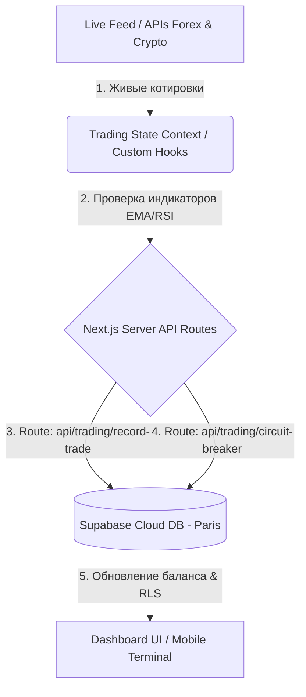

# Technical Specification: SafeTrade Analytics
## Техническая спецификация софта — Сессия 18

Этот документ описывает технологический стек, структуру базы данных, архитектуру API, связи между компонентами проекта и логику движения данных.

---

## 🛠️ 1. Technology Stack (Технологический стек)

*   **Frontend Framework:** Next.js 16 (App Router) + React 19 + TypeScript.
*   **Styling & CSS:** Tailwind CSS + Framer Motion (для Bloomberg-level анимаций и эффектов).
*   **Icons:** Lucide React.
*   **Charts:** Lightweight Charts (by TradingView) — отображение живых графиков.
*   **Backend & Database:** Supabase (PostgreSQL) — хранение балансов, сделок и системных логов.
*   **Authentication:** Supabase Auth (Email & Password).
*   **Session Management:** `@supabase/ssr` — серверная синхронизация сессий через куки (Cookies).

---

## 🗺️ 2. Architecture & Data Flow (Связи между частями проекта)

Система использует реактивный поток данных для минимизации задержек и быстрой отрисовки метрик.

### Движение данных:
1.  **Источники данных (Data Source):** Котировки Forex (EUR/USD, GBP/USD) и Crypto (BTC/USDT) поступают на клиентский уровень в реальном времени.
2.  **Управление состоянием (React State):** Контекст `TradingContext` через хук `useTradingState` обновляет состояние терминала (активные ордера, баланс, дневная статистика) каждые 500мс.
3.  **Серверные шлюзы (API Routes):** Фронтенд отправляет транзакции на Next.js API Routes (в папке `app/api/`), которые валидируют операции и рассчитывают риски на сервере.
4.  **База данных (Database):** Данные сохраняются в СУБД Supabase, отсекая несанкционированный доступ встроенными правилами безопасности.

---

## 🛡️ 3. Backend & API (Логика шлюзов и безопасности)

Финансовые расчеты и защитные механизмы вынесены на сторону сервера для исключения манипуляций в браузере:

*   **API записи сделок (`/api/trading/record-trade`):** POST-маршрут принимает отчеты о закрытых ордерах и фиксирует их финансовый результат в таблице `trades`.
*   **API предохранителя (`/api/trading/circuit-breaker`):** Проверяет дневной результат. Если за текущие сутки убыток по базе данных превышает **1%** (более **50 EUR** от баланса), активирует блокировку торговых операций на 24 часа.
*   **Спецификация автоматических защитных алгоритмов:**
    *   *Расчет лота:* `Lot = (Account Balance * 0.01) / Distance Stop-Loss` (риск на сделку строго 1% / 50.00 EUR).
    *   *Greed Lock (Щит прибыли):* После достижения дневной цели в `+50.00 EUR`, лимит сентимента на открытие сделок ужесточается с `75%` до `80%`.
    *   *EOD Halt (Авто-сон):* С 18:00 пятницы до 09:00 понедельника торги блокируются, а все открытые позиции принудительно закрываются для защиты от рыночных гэпов.

---

## 💾 4. База данных и безопасность RLS (Database & Security)

Доступ к таблицам СУБД Supabase (PostgreSQL) разграничен на уровне ядра базы данных с помощью политик **Row Level Security (RLS)**:
*   Таблица `users` (учетные записи и балансы): доступна для чтения и записи только авторизованному владельцу (`auth.uid() = id`).
*   Таблица `trades` (история ордеров): разрешено добавление и чтение записей только владельцу сделок. Прямые SQL-инъекции или подмена ID на клиенте блокируются на стороне PostgreSQL.
*   **Защита маршрутов (Route Protection):** Next.js Middleware (`middleware.ts`) перехватывает любые запросы к панели управления `/admin/*` и перенаправляет неавторизованных пользователей на страницу входа `/admin/login`.

---
*Created as part of Session 18. Personal & Educational project.*
