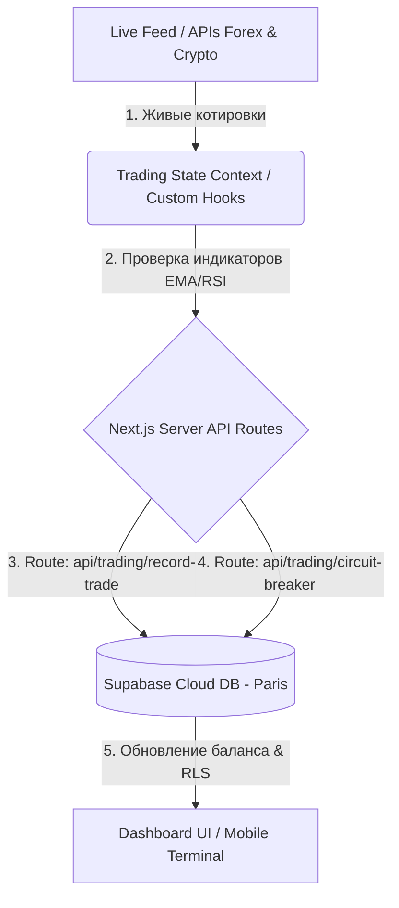

# Technical Specification: SafeTrade Analytics
## Техническая спецификация софта — Сессия 18

Этот документ описывает технологический стек, структуру базы данных, архитектуру API, связи между компонентами проекта и логику движения данных.

---

## 🛠️ 1. Technology Stack (Технологический стек)

*   **Frontend Framework:** Next.js 16 (App Router) + React 19 + TypeScript.
*   **Styling & CSS:** Tailwind CSS + Framer Motion (для Bloomberg-level анимаций и эффектов).
*   **Icons:** Lucide React.
*   **Charts:** Lightweight Charts (by TradingView) — отображение живых графиков.
*   **Backend & Database:** Supabase (PostgreSQL) — хранение балансов, сделок и системных логов.
*   **Authentication:** Supabase Auth (Email & Password).
*   **Session Management:** `@supabase/ssr` — серверная синхронизация сессий через куки (Cookies).

---

## 🗺️ 2. Architecture & Data Flow (Связи между частями проекта)

Система использует реактивный поток данных для минимизации задержек и быстрой отрисовки метрик.

### Движение данных:
1.  **Источники данных (Data Source):** Котировки Forex (EURUSD), Commodities (GOLD) и Crypto (BTC, ETH) поступают на клиентский уровень в реальном времени.
2.  **Управление состоянием (React State):** Контекст `TradingContext` через хук `useTradingState` обновляет состояние терминала (активные ордера, баланс, дневная статистика) каждые 500мс.
3.  **Серверные шлюзы (API Routes):** Фронтенд отправляет транзакции на Next.js API Routes (в папке `app/api/`), которые валидируют операции и рассчитывают риски на сервере.
4.  **База данных (Database):** Данные сохраняются в СУБД Supabase, отсекая несанкционированный доступ встроенными правилами безопасности.

---

## 🛡️ 3. Backend & API (Логика шлюзов и безопасности)

Финансовые расчеты и защитные механизмы вынесены на сторону сервера для исключения манипуляций в браузере:

*   **API записи сделок (`/api/trading/record-trade`):** POST-маршрут принимает отчеты о закрытых ордерах и фиксирует их финансовый результат в таблице `trades`. Цены входа (`entry_price`) и выхода (`exit_price`) записываются динамически на основе текущей рыночной цены торгуемого актива (Gold, TSLA, SPUS, EURUSD, NDX, BTC) и процентного изменения баланса, исключая некорректный хардкод сторонних цен.
*   **API предохранителя (`/api/trading/circuit-breaker`):** Проверяет дневной результат. Если за текущие сутки убыток по базе данных превышает **1%** (более **50 EUR** от баланса), активирует блокировку торговых операций на 24 часа.
*   **Спецификация автоматических защитных алгоритмов:**
    *   *Расчет лота:* `Lot = (Account Balance * 0.01) / Distance Stop-Loss` (риск на сделку строго 1% / 50.00 EUR).
    *   *Greed Lock (Щит прибыли):* После достижения дневного профита в +1.0% (+50.00 EUR), автопилот переходит в режим Profit Shield: лимит сентимента на открытие новых сделок повышается с 75% до 80%, лоты для новых сделок снижаются на 50%, а для сопровождения прибыли используется динамический Трейлинг-Стоп (активация с +2.0% прибыли, шаг/дистанция 0.5%) для фиксации прибыли при откатах рынка.
    *   **EOD Halt (Авто-сон) и Утренний Reset:** С 18:00 до 09:00 CET по рабочим дням, а также полностью в выходные (суббота и воскресенье) и официальные праздничные дни (Новый год, Рождество и др.) торги блокируются, а все открытые позиции принудительно закрываются для защиты от рыночных гэпов и низкой ликвидности. В **09:00 CET** при наступлении нового торгового дня система автоматически обнуляет накопленную дневную статистику потерь и прибыли, сбрасывает аварийный предохранитель (`autoHalted` = `false`), снимает паузу (`isPaused` = `false`) и автоматически активирует режим автоторговли (`isAutotrade` = `true`), обеспечивая полную автономию робота.

---

## 💾 4. База данных и безопасность RLS (Database & Security)

Доступ к таблицам СУБД Supabase (PostgreSQL) разграничен на уровне ядра базы данных с помощью политик **Row Level Security (RLS)**:
*   Таблица `users` (учетные записи и балансы): доступна для чтения и записи только авторизованному владельцу (`auth.uid() = id`).
*   Таблица `trades` (история ордеров): разрешено добавление и чтение записей только владельцу сделок. Прямые SQL-инъекции или подмена ID на клиенте блокируются на стороне PostgreSQL.
*   **Защита маршрутов (Route Protection):** Next.js Middleware (`middleware.ts`) перехватывает любые запросы к панели управления `/admin/*` и перенаправляет неавторизованных пользователей на страницу входа `/admin/login`.

---

## 💾 5. Источники данных и вычисления (Data Provenance & Engine Calculations Mapping)

Для обеспечения прозрачности архитектуры, ниже приведена подробная карта происхождения данных по всем ключевым функциям терминала SafeTrade Analytics.

| Функция / Модуль | Ввод пользователя (User Input) | База данных (Supabase Cloud DB) | Внешний источник (Live Feed / APIs) | Вычисления системы (RAM Calculations) |
| :--- | :--- | :--- | :--- | :--- |
| **1. Трендовый Робот (Core Trend)** | Отсутствует (автопилот). | Исторический баланс (GET-запрос при старте). | Стриминг котировок (500мс), Sentiment Confidence. | • Расчет направления (BUY/SELL) по индикаторам. • Сверка просадки/достижения целей. |
| **2. Скрытый Стоп-Лосс (Stealth SL)** | Выбор лимита на слайдере (3.0% - 5.0%). | Отсутствует (хранится локально в RAM). | Текущая рыночная цена актива (Forex/Crypto feed). | • Сравнение текущей цены с ценой входа. • Расчет уровня выхода (3-5%). • Отправка Market Sell при достижении лимита. |
| **3. Аварийный Стоп-Лосс (Emergency SL)** | Отсутствует. | Отсутствует (отправляется сразу на биржу). | Отсутствует. | • Вычисление биржевого уровня: $\text{Stealth SL} + 2.0\%$. |
| **4. Хеджирование (Correlation Hedging)** | Тумблер Hedge Filter (Вкл/Выкл). | Отсутствует. | Котировки Золота (XAU/USD). | • Расчет компенсационного лота по Золоту. • Сверка корреляции падения BTC с ростом XAU. |
| **5. Микро-скальпинг (Momentum Scalping)** | Тумблер Momentum Scalp (Вкл/Выкл). | Отсутствует. | Стриминг котировок (500мс). | • Расчет фазы затухания тренда. • Расчет микро-целей (TP 0.45% - 0.75% / SL 0.3% - 0.5%, обеспечивая соотношение риск/прибыль не менее 1:1.5). |
| **6. Новостной Щит (News Shield)** | Отсутствует (автопилот). | Отсутствует. | Календарь новостей (Tier-1 News Flags), волатильность ATR. | • Таймер обратного отсчета (15/30 мин). • Авто-блокировка торговли по сектору при новости. |
| **7. Предохранитель API (API Rate Shield)** | Отсутствует. | Отсутствует. | Сигналы перегрузки API (HTTP 429). | • Постановка ордеров в FIFO-очередь. • Расчет джиттера (100-350мс) и динамической задержки (рассчитывается на уровне 70% от лимита активного шлюза: например, 142мс для лимита 10/сек, 28мс для лимита 50/сек). • Отсчет 5-секундного Cooldown. |
| **8. Дневной лимит (Circuit Breaker)** | Отсутствует. | Суммарные сделки за сутки (`trades`), системный лог блокировки. | Отсутствует. | • Вычисление суточного финансового результата: $\text{Сумма PnL за сегодня}$. • Блокировка UI при убытке > 1% (50 EUR). |

*Примечание: Детальная математическая формула расчёта Sentiment Confidence (Market Pulse %) приведена в [Спецификации интерфейса (functional-map.md)](file:///c:/Users/adaml/OneDrive/Bureau/t/specs/architecture/functional-map.md#L156-L175).*

---
*Created as part of Session 18. Personal & Educational project.*
