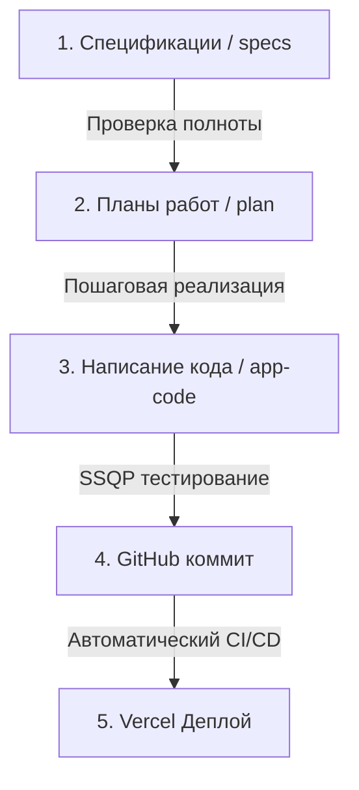

# 📅 Work Plans (Методология планирования работ)

## 📌 Процесс и стандарты ведения разработки

Этот документ описывает методологию планирования работ, стандарты тестирования и цепочку публикации кода в проекте SafeTrade Analytics.

---

## 🔄 1. Цикл разработки (Спеки ➔ Планы ➔ Код)

В проекте строго соблюдается последовательность перехода от требований к реализации:

1.  **Спецификации (Specs):** Перед любым действием требования детально описываются в файлах папки `specs/`. Если требований нет или они неясны — работа не начинается.
2.  **Планы работ (Plans):** На основе требований составляется пошаговый план в папке `plan/` с четкими критериями проверки каждого шага.
3.  **Код (Code):** Написание кода в папке `app-code/` происходит строго по плану. Код не пишется «на ходу» или без привязки к плану.
4.  **GitHub и CI/CD:** После локальной проверки качества изменения коммитятся в Git и проходят автоматические тесты в GitHub Actions.

---

## 📋 2. Стандарты ведения планов

Для удобства контроля все планы разделены на две категории и вынесены в отдельную директорию:

*   **[Активный план (Active Plan)](file:///c:/Users/adaml/OneDrive/Bureau/t/plan/active-plan.md):** Содержит только те задачи, над которыми ведется работа в текущей сессии. Любая начатая задача помечается статусом в процессе (`[/]`), завершенная — (`[x]`).
*   **[Завершенный план (Completed Plan)](file:///c:/Users/adaml/OneDrive/Bureau/t/plan/completed-plan.md):** Архив всех успешно завершенных, протестированных и залитых на GitHub этапов разработки с указанием версий и дат.

---

## 🛡️ 3. Проверка результата и отправка в репозиторий

Каждый этап плана считается завершенным только после выполнения следующих условий:
1.  **Локальное тестирование (QA):** Запуск линтера (`npm run lint`), компилятора (`npx tsc --noEmit`) и тестов (`npm run test`).
2.  **Компиляция билда:** Запуск сборки (`npm run build`) без предупреждений и ошибок.
3.  **GitHub Push:** Заливка ветки на GitHub, дожидаясь зеленого статуса автоматической сборки (CI).
4.  **Переход к следующему шагу:** Только после подтверждения успешности предыдущего шага берется следующая задача из активного плана.
